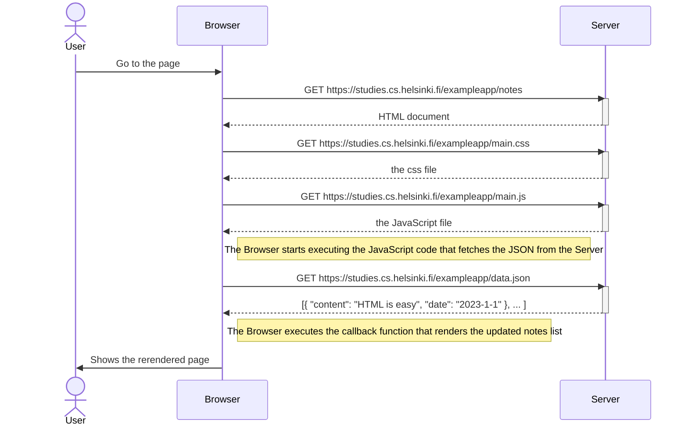

**User enters SPA page**

```mermaid
sequenceDiagram
    actor User
    participant Browser
    participant Server

    User->>Browser: Go to the page

    Browser->>Server: GET https://studies.cs.helsinki.fi/exampleapp/notes
    activate Server
    Server-->>Browser: HTML document
    deactivate Server

    Browser->>Server: GET https://studies.cs.helsinki.fi/exampleapp/main.css
    activate Server
    Server-->>Browser: the css file
    deactivate Server

    Browser->>Server: GET https://studies.cs.helsinki.fi/exampleapp/main.js
    activate Server
    Server-->>Browser: the JavaScript file
    deactivate Server

    Note right of Browser: The Browser starts executing the JavaScript code that fetches the JSON from the Server

    Browser->>Server: GET https://studies.cs.helsinki.fi/exampleapp/data.json
    activate Server
    Server-->>Browser: [{ "content": "HTML is easy", "date": "2023-1-1" }, ... ]
    deactivate Server

    Note right of Browser: The Browser executes the callback function that renders the updated notes list

    Browser->>User: Shows the rerendered page
```